### Microservices E-commerce Order Flow

This project demonstrates a robust microservices architecture for an e-commerce order system, leveraging **RabbitMQ** as a message broker for asynchronous communication. The solution is composed of three distinct APIs: `OrderAPI`, `StockAPI`, and `PaymentAPI`, which communicate indirectly through a series of domain events. This architectural design ensures services remain **loosely coupled**, which is paramount for achieving greater scalability, resilience, and maintainability.

-----

### Architectural Overview & Event-Driven Workflow

The diagram below provides a visual representation of the event-driven communication flow that orchestrates the order creation process. This pattern allows each service to operate independently, responding to events rather than direct requests, which mitigates single points of failure.

```mermaid
%%{init: {"themeVariables": {"edgeLabelBackground":"#fff", "fontSize":"18px", "fontFamily":"Segoe UI, Arial, sans-serif", "curve":"cardinal"}}}%%
graph LR

%% Service nodes
OrderService["Order Service (OrderAPI)"]:::service
StockService["Stock Service (StockAPI)"]:::stock
PaymentService["Payment Service (PaymentAPI)"]:::payment

%% Database nodes
OrderDB(["Order Database"]):::db
StockDB(["Stock Database"]):::db
PaymentDB(["Payment Database"]):::db

%% Queue nodes
Queue1(["Stock Order Created Queue"]):::queue
Queue2(["Payment Stock Reserved Event Queue"]):::queue
Queue3(["Order Payment Completed Queue"]):::queue
Queue4(["Order Payment Failed Queue"]):::queue

%% Client node
Client["Client Request"]:::client

%% Flows (use thick lines for commands, dashed for events)
Client ==> |"Create Order"| OrderService

OrderService ==> |"Write to DB"| OrderDB
OrderService -. "Publish Order Created Event" .-> Queue1

Queue1 ==> |"Consume Event"| StockService
StockService ==> |"Check Stock"| StockDB
StockService -. "Publish Stock Reserved Event" .-> Queue2
StockService -. "Publish Stock Not Available Event" .-> Queue4

Queue2 ==> |"Consume Event"| PaymentService
PaymentService ==> |"Process Payment"| PaymentDB
PaymentService -. "Publish Payment Completed Event" .-> Queue3
PaymentService -. "Publish Payment Failed Event" .-> Queue4

Queue3 ==> |"Consume Event"| OrderService
OrderService ==> |"Mark Order as Completed"| OrderDB

Queue4 ==> |"Consume Event"| OrderService
OrderService ==> |"Mark Order as Failed"| OrderDB

%% Styling
classDef client fill:#2632A0,stroke:#1B2156,stroke-width:3px,color:#fff,font-weight:bold;
classDef service fill:#D1E9FF,stroke:#176CBE,stroke-width:3px,color:#042940,font-weight:bold;
classDef stock fill:#B5E7A0,stroke:#52B788,stroke-width:3px,color:#15573F,font-weight:bold;
classDef payment fill:#FFE28A,stroke:#B39200,stroke-width:3px,color:#665500,font-weight:bold;
classDef db fill:#F6F7F9,stroke:#444D5C,stroke-width:2.5px,color:#111;
classDef queue fill:#FF7A76,stroke:#B91616,stroke-width:2.5px,color:#fff,stroke-dasharray: 8 5;
classDef eventLink stroke-dasharray: 6 4,stroke-width:3px;
classDef thickLink stroke-width:4px,stroke:#0d47a1;
classDef label font-weight:bold,font-size:18px;

class OrderService service;
class StockService stock;
class PaymentService payment;
class OrderDB,StockDB,PaymentDB db;
class Queue1,Queue2,Queue3,Queue4 queue;
class Client client;

%% Edge styling for events (dashed)
linkStyle 2,5,6,8,9 stroke:#757575,stroke-dasharray: 7 5,stroke-width:3px;
%% link numbers are: 
%% 0: Client==>OrderService
%% 1: OrderService==>OrderDB
%% 2: OrderService-.->Queue1    [event]
%% 3: Queue1==>StockService
%% 4: StockService==>StockDB
%% 5: StockService-.->Queue2    [event]
%% 6: StockService-.->Queue4    [event]
%% 7: Queue2==>PaymentService
%% 8: PaymentService-.->Queue3  [event]
%% 9: PaymentService-.->Queue4  [event]
%% 10: PaymentService==>PaymentDB
%% 11: Queue3==>OrderService
%% 12: OrderService==>OrderDB
%% 13: Queue4==>OrderService
%% 14: OrderService==>OrderDB

%% Make main command/concrete action links even thicker
linkStyle 0,1,3,4,7,10,11,12,13,14 stroke:#1976d2,stroke-width:4px;

%% Subgraphs for group separation (visual purposes only, no inner direction override since edges cross subgraphs)
subgraph "E-Commerce Microservices Flow"
    direction LR
    subgraph "Services"
        OrderService
        StockService
        PaymentService
    end
    subgraph "Databases"
        OrderDB
        StockDB
        PaymentDB
    end
    subgraph "Queues"
        Queue1
        Queue2
        Queue3
        Queue4
    end
end

```

### Core Workflow: A Step-by-Step Journey 🚀

#### 1\. Order API: The Command Center

A client request initiates the workflow. The `OrderAPI` first persists the order in its **MSSQL** database with a **`Suspend`** status. This is a crucial step to ensure atomicity and a consistent state. It then emits an **`OrderCreatedEvent`** to RabbitMQ, decoupling the order creation from the downstream processes.

\<br\>

#### 2\. Stock API: The Inventory Guard

The `StockAPI` consumes the **`OrderCreatedEvent`**. It performs a critical stock check and, if available, reserves the items by decrementing the count in its **MongoDB** database. This action is followed by publishing a **`StockReservedEvent`**, serving as a green light for payment processing.

\<br\>

#### 3\. Payment API: The Financial Gateway

The `PaymentAPI` consumes the **`StockReservedEvent`**. It processes the payment and, based on the outcome, publishes a **`PaymentCompletedEvent`** or **`PaymentFailedEvent`**. This decision-making step is central to the system's reliability.

\<br\>

#### 4\. Order API: The Finalizer

Finally, the `OrderAPI` consumes the payment result events. If a **`PaymentCompletedEvent`** is received, it updates the order's status to **`Completed`**, finalizing the transaction. If a **`PaymentFailedEvent`** is received, it updates the status to **`Failed`** and can trigger compensation logic, such as releasing the reserved stock.

This event-driven flow ensures that each service is highly focused and efficient, while the entire system remains responsive and resilient to failures in any single component.
